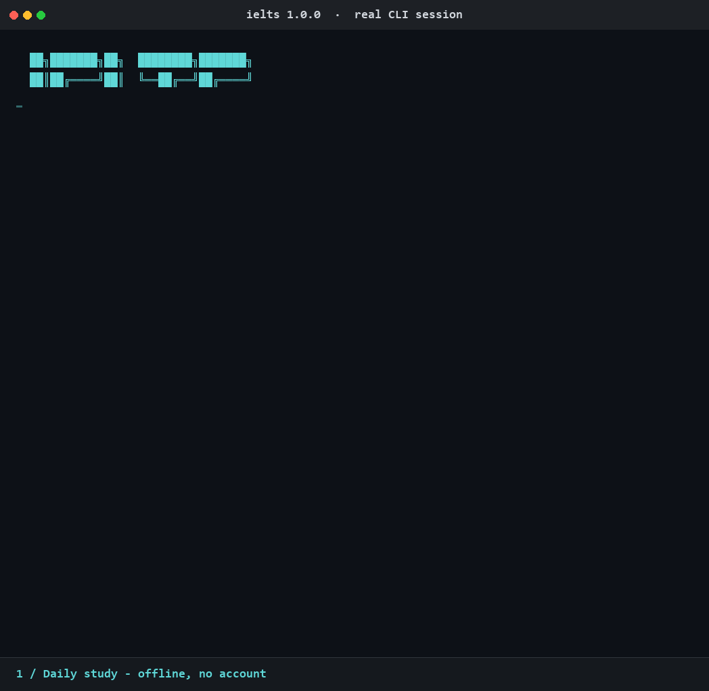

# IELTS Codex

[](https://www.python.org/)
[](LICENSE)

A Codex-inspired IELTS vocabulary trainer for the terminal, featuring slash
commands, focused word cards, spelling practice, instant feedback, spaced
repetition, and local progress tracking.

IELTS Codex uses only the Python standard library. The core trainer works
offline and requires no account, API key, or runtime dependency. An optional,
user-approved sync can refresh English definitions from Open English WordNet
(OEWN). The current learning interface is Chinese-first.

> [!NOTE]
> This is an independent open-source learning tool. It is not an official
> OpenAI product and is not affiliated with or endorsed by OpenAI.

## Demo



## Features

- Codex-style interactive prompt and slash commands
- New-word learning and due-card review
- Chinese-to-English spelling quizzes
- Again / Hard / Good / Easy spaced-repetition ratings
- 72 bundled words across 9 IELTS-oriented topics
- English definitions, Chinese meanings, phonetics, bilingual examples, and synonyms
- Local, atomic JSON progress storage
- Daily goals, streaks, accuracy, and mastery statistics
- English, Chinese, and synonym search
- Optional Open English WordNet 2025 English-definition sync
- Experimental storm-survival spelling game with fog, hunger, and a companion
- Optional image-inspired pet creation through a bring-your-own-key vision API
- Zero runtime dependencies

## Quick start

Python 3.10 or later is required.

```bash
git clone https://github.com/Miracle-0v0/ielts-codex-cli.git
cd ielts-codex-cli
./ielts.py
```

You can also install the `ielts-codex` command:

```bash
python3 -m pip install .
ielts-codex
```

## Interactive commands

| Command | Description |
| --- | --- |
| `/learn [count] [topic]` | Learn unseen words; defaults to 10 |
| `/review [count] [topic]` | Review cards that are due today |
| `/quiz [count] [topic]` | Run a Chinese-to-English spelling quiz |
| `/search <query>` | Search by English, Chinese meaning, or synonym |
| `/words [topic]` | Browse words and learned status |
| `/topics` | Show progress by topic |
| `/today` | Show today's plan and goal |
| `/stats` | Show coverage, accuracy, streak, and mastery |
| `/goal <count>` | Change the daily review goal |
| `/sync [status] [--force] [--dry-run]` | Sync OEWN definitions or inspect the local cache |
| `/game [count] [topic]` | Start an experimental spelling expedition |
| `/game pet create <image>` | Create a companion with a user-configured vision API |
| `/game pet status` | Inspect the locally saved companion metadata |
| `/game providers` | Show supported API provider profiles |
| `/clear` | Clear the terminal |
| `/quit` | Save and exit |

At the main prompt, type `/` to open the command palette. Use the up and down
arrow keys to select a command, `Enter` to run it, or `Tab`/the right arrow to
complete it before adding arguments. Non-interactive input automatically falls
back to the plain line prompt.

The count and topic can appear in either order:

```text
› /learn environment 8
› /review 15 education
› /quiz 5 technology
```

During a learning or review card:

- `Enter` reveals the answer.
- `h` shows a cloze-example hint.
- `s` skips the card without changing its schedule.
- `q` ends the current session.
- `1` / `2` / `3` / `4` rates recall as Again / Hard / Good / Easy.

Enter a bare word to open its dictionary card:

```text
› ubiquitous
```

## Spelling practice

Run:

```text
› /quiz 10
```

The quiz shows a Chinese meaning and asks for the English spelling. A correct
answer advances the card. A misspelling reveals the answer and schedules the
card as `Again`. Use `h` for a hint, `s` to skip, or `q` to stop.

## Experimental game mode

Version 0.4.0 introduces a terminal survival expedition:

```text
› /game
› /game 3 environment
```

Move with `WASD` or the arrow keys and walk into letter monsters in the exact
spelling order. A wrong monster costs hunger. Rain moves across the visible
ground, unexplored cells stay under fog, and taking too long progresses through
hunger, dizziness, and health loss. Your pet follows behind and extends the
visible area.

The two help channels are intentionally separate:

- `h` advances through learning hints: phonetics, a cloze example, synonyms,
  and finally the next letter.
- `g` asks the pet for a rough direction to the current target without
  revealing the letter.

Hints are drawn only from the existing curated word fields. The vision API does
not invent definitions, etymologies, examples, or mnemonics. A successful round
updates the same spaced-repetition card used by `/learn`, `/review`, and
`/quiz`. Passive pet visibility is free. Requesting a learning hint or pet
direction caps the result at `Hard`, while directly revealing the next letter
records `Again`.

Interactive terminals use a smooth alternate-screen animation. Redirected
input, `TERM=dumb`, and terminals that are too small automatically use a
turn-based interface so slow input is not punished by wall-clock time.

### Create a pet from an image

The game includes a small offline puppy that follows the player and opens the
fog by default. Creating a custom pet is optional and replaces that puppy's
profile using your own vision-model account and API key. Configure a provider
before launching IELTS Codex:

```bash
export IELTS_CODEX_GAME_PROVIDER=kimi
export IELTS_CODEX_GAME_MODEL='<vision-capable-model-id>'
read -rsp 'API key: ' IELTS_CODEX_GAME_API_KEY
export IELTS_CODEX_GAME_API_KEY
ielts-codex
```

Then run:

```text
› /game pet create ./my-pet-photo.jpg
```

Supported provider profiles use OpenAI-compatible Chat Completions:

| Provider value | Default request endpoint |
| --- | --- |
| `openai` | `https://api.openai.com/v1/chat/completions` |
| `kimi` | `https://api.moonshot.ai/v1/chat/completions` |
| `qwen` | `https://dashscope.aliyuncs.com/compatible-mode/v1/chat/completions` |
| `glm` | `https://open.bigmodel.cn/api/paas/v4/chat/completions` |
| `custom` | Set `IELTS_CODEX_GAME_API_URL` |

No model ID is hard-coded because available multimodal models change. Select a
model that accepts image input. `IELTS_CODEX_GAME_API_URL` can also override a
named profile, which is useful for a regional or workspace-specific Qwen
endpoint and for compatible gateways.

Before any upload, the CLI displays the provider, model, destination host,
image type, and image size, then asks for explicit confirmation. The API key,
raw image, Base64 payload, and original path are never written to the progress
store, and redirects are refused so the request cannot silently change hosts.
Only the validated pet profile, provider/model metadata, destination host,
timestamp, and image SHA-256 digest are saved locally.

The provider schemas and endpoints follow the official
[OpenAI Chat Completions](https://platform.openai.com/docs/api-reference/chat),
[Kimi Chat Completion](https://platform.kimi.ai/docs/api/chat),
[Qwen OpenAI-compatible Chat](https://help.aliyun.com/en/model-studio/qwen-api-via-openai-chat-completions),
and [GLM vision-model](https://docs.bigmodel.cn/cn/guide/models/free/glm-4.6v-flash)
documentation. Provider charges and data policies belong to the selected
service; IELTS Codex does not proxy the request.

## Non-interactive mode

Commands can also be called directly from a shell:

```bash
python3 ielts.py stats
python3 ielts.py topics
python3 ielts.py search biodiversity
python3 ielts.py learn -n 5 -t environment
python3 ielts.py --no-color stats
python3 ielts.py sync
python3 ielts.py game -n 3 -t environment
```

## Vocabulary data and provenance

The bundled vocabulary is a small, static, project-maintained dataset stored in
[`src/ielts_codex/data/words.json`](src/ielts_codex/data/words.json).

The current 72 base entries were written and curated specifically for this
project using general IELTS-oriented vocabulary knowledge. They were not copied
from a commercial dictionary or textbook and are released under the
repository's MIT License. The dataset is not an official Cambridge IELTS word
list.

Each entry contains:

- `word`
- `phonetic`
- `part_of_speech`
- `meaning_zh`
- `definition_en`
- `example`
- `example_zh`
- `synonyms`
- `topic`
- `band`

### Optional Open English WordNet sync

Every interactive launch offers a choice to connect to the internet and check
for the latest [Open English WordNet](https://en-word.net/) release. Declining
continues offline without making a network request. You can also start a sync
explicitly:

```text
› /sync
› /sync status
› /sync --dry-run
```

Or run the same operation without entering the interactive prompt:

```bash
ielts-codex sync
ielts-codex sync status
ielts-codex sync --force
# From a source checkout:
python3 ielts.py sync
```

`status` reads only the local overlay metadata. `--dry-run` previews a proposed
overlay without writing it, while `--force` re-downloads the release even when
the cached version is current; the flags may be combined.

The sync discovers the current OEWN release from its official GitHub release
metadata and downloads the verified standard JSON release asset (with the
official `en-word.net` URL supported for legacy releases). It creates a local
overlay for matching bundled words; it never rewrites
[`words.json`](src/ielts_codex/data/words.json).

Only `definition_en` and its source/license metadata are overlaid. The
project-maintained Chinese meaning and example, English example, phonetic
transcription, part of speech, topic, band, and synonyms remain unchanged. A
sync therefore refreshes the English definition without discarding the
human-curated learning context.

The overlay cache is stored next to the progress file:

```text
~/.ielts-codex/oewn_overlay.json
```

`IELTS_CODEX_HOME` and `--data-dir` relocate both the progress file and this
cache. The downloaded archive is temporary; after validation and extraction,
only the compact overlay is retained. A new cache is committed atomically only
after the download and parsing succeed. If the network or upstream service is
unavailable, the session continues with the last valid cache when one exists,
or with the bundled definitions otherwise.

OEWN-derived English definitions are not relicensed under this project's MIT
License. Open English WordNet 2025 is provided by the Open English WordNet team
under [CC BY 4.0](https://creativecommons.org/licenses/by/4.0/) and incorporates
material from Princeton WordNet under the Princeton WordNet license. See
[THIRD_PARTY_NOTICES.md](THIRD_PARTY_NOTICES.md) for attribution, modification
details, source links, and applicable terms.

### Updating the vocabulary dataset

For a normal manual update:

1. Edit [`words.json`](src/ielts_codex/data/words.json).
2. Keep `word` values lowercase and unique.
3. Provide every required field and verify the phonetic transcription,
   definition, translation, example, topic, and band value.
4. Run the CLI locally and verify loading, lookup, learning, and spelling
   behavior.
5. Record the dataset change in [`CHANGELOG.md`](CHANGELOG.md). When publishing
   a new package release, update the version in both `pyproject.toml` and
   `src/ielts_codex/__init__.py`.

Changes to the bundled MIT-licensed base dataset and changes obtained through
the optional OEWN overlay are intentionally separate. Do not copy synced OEWN
definitions back into `words.json` without retaining the applicable third-party
attribution and license terms.

## Progress storage

Learning progress is stored by default at:

```text
~/.ielts-codex/progress.json
```

Each rating is saved immediately using a temporary file followed by an atomic
replacement. This reduces the chance of corruption after an unexpected exit.

Game companion metadata is stored separately at:

```text
~/.ielts-codex/game.json
```

That file never contains an API key or image payload.

Use `IELTS_CODEX_HOME` or `--data-dir` to choose another location:

```bash
IELTS_CODEX_HOME=./my-progress python3 ielts.py
python3 ielts.py --data-dir ./my-progress stats
```

## Spaced-repetition behavior

- `Again`: a new word remains in today's queue; a lapsed review returns tomorrow.
- `Hard`: uses a short interval and slightly lowers the ease factor.
- `Good`: advances through 1 day, 3 days, and then adaptive intervals.
- `Easy`: moves directly to a longer interval.

A card is counted as mastered after reaching a 21-day interval or at least five
successful repetitions.

## Contributing

Issues and pull requests are welcome. See [CONTRIBUTING.md](CONTRIBUTING.md)
before submitting a change.

Release history is available in [CHANGELOG.md](CHANGELOG.md).

## License

Project code and the bundled project-maintained vocabulary are available under
the [MIT License](LICENSE). Optional synced OEWN content is subject to the
notices and licenses in [THIRD_PARTY_NOTICES.md](THIRD_PARTY_NOTICES.md).
